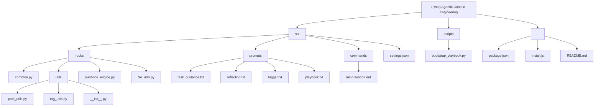

# Agentic Context Engineering

[Root Directory](./CLAUDE.md)

## Project Vision

Agentic Context Engineering (ACE) is an intelligent knowledge accumulation and context injection system designed specifically for Claude Code. It automatically extracts, evaluates, and integrates key insights from conversation trajectories to enable continuous knowledge evolution and intelligent context injection in future sessions.

## Architecture Overview

### System Design Philosophy

- **Zero-Friction Learning**: Automatically extracts valuable insights from conversations without manual maintenance
- **Intelligent Evaluation**: Dynamically scores based on actual effectiveness, retaining valuable knowledge while eliminating irrelevant content
- **Precision Injection**: Intelligently matches relevant knowledge based on conversation topics to enhance Claude Code's response quality
- **Continuous Evolution**: Avoids duplication through semantic similarity merging (≥80%) and continuously optimizes through scoring mechanism

### Core Hook Mechanism

The system achieves full automation through three key hooks:

1. **UserPromptSubmit** - Intelligently injects relevant knowledge at the start of new sessions (10s timeout)
2. **SessionEnd** - Extracts and evaluates insights when sessions end (120s timeout)
3. **PreCompact** - Protects important knowledge before context compaction (120s timeout)

## ✨ Module Structure Diagram



## Module Index

| Module | Path | Language | Responsibility |
|--------|------|----------|---------------|
| Hooks Core | `src/hooks/` | Python | Hook implementations for Claude Code integration |
| Utils | `src/hooks/utils/` | Python | Shared utilities for path management, tagging, and file operations |
| Playbook Engine | `src/hooks/playbook_engine.py` | Python | Knowledge base management and operations |
| File Utils | `src/hooks/file_utils.py` | Python | File loading and template management utilities |
| Prompts | `src/prompts/` | Text | LLM prompt templates for various operations |
| Scripts | `scripts/` | Python | Helper scripts for system management |
| Commands | `src/commands/` | Markdown | Custom Claude Code commands |
| Installation | `./` | Node.js/JS | Installation and deployment automation |

## Running and Development

### Installation

```bash
git clone https://github.com/greatyingzi/agentic_context_engineering.git
cd agentic_context_engineering
npm install
```

### Environment Setup

```bash
# Install dependencies (uv recommended)
uv venv ~/.claude/.venv
uv pip install --python ~/.claude/.venv/bin/python3 anthropic

# Configure API (optional, supports fallback)
export AGENTIC_CONTEXT_API_KEY="your-api-key"
export AGENTIC_CONTEXT_MODEL="claude-3-5-sonnet-20241022"
```

### Development Workflow

1. Make changes to hook files in `src/hooks/`
2. Run `npm install` to update installation
3. Restart Claude Code for changes to take effect
4. Use diagnostic mode (`touch .claude/diagnostic_mode`) for debugging

### ⚠️ CRITICAL DEVELOPMENT PRINCIPLE

🚫 **NEVER** modify installed scripts and configurations in `~/.claude/` directory
✅ **ALWAYS** make changes within the project directory

**Why this matters:**
- Maintains version control integrity
- Enables proper change tracking and management
- Ensures modifications persist across reinstallation
- Supports team collaboration and code review

**Correct workflow:**
1. Modify source files in `src/` directory
2. Run `npm install` to apply changes
3. Restart Claude Code to load updates
4. Never directly edit files in `~/.claude/`

## Testing Strategy

- Unit tests for individual utility functions in `src/hooks/utils/`
- Integration tests for hook workflows
- Manual testing through Claude Code sessions
- Diagnostic logging available via `.claude/diagnostic_mode`
- Bootstrap testing with `/init-playbook` command

## Coding Standards

### Python Standards
- Use type hints for all function signatures
- Follow PEP 8 style guidelines
- Modular design with clear separation of concerns
- Comprehensive docstrings for all public functions

### File Organization
- Keep modules focused and cohesive
- Use descriptive filenames
- Maintain backward compatibility through `common.py`
- Store templates in `src/prompts/` directory

### Error Handling
- Graceful degradation when APIs are unavailable
- Diagnostic logging for troubleshooting
- Atomic file operations for data integrity
- Proper exception handling with meaningful error messages

## AI Usage Guidelines

### LLM Integration
- Use Anthropic Claude API for intelligent analysis
- Implement fallback behavior when API unavailable
- Cache results when appropriate to reduce token usage
- Use structured prompts for consistent outputs

### Knowledge Management
- Semantic similarity threshold: ≥80% for merging
- Scoring system: Helpful +1, Harmful -3, Neutral 0
- Auto-cleanup: Items with score ≤ -5 removed
- Maximum playbook size: 250 key points

## Change Log (Changelog)

### 2025-12-09 22:14:39
- Initial AI context documentation generation
- Created comprehensive module structure with Mermaid diagram
- Added navigation breadcrumbs for all modules
- Identified 4 main modules requiring documentation

---
*Last updated: 2025-12-09 22:14:39*