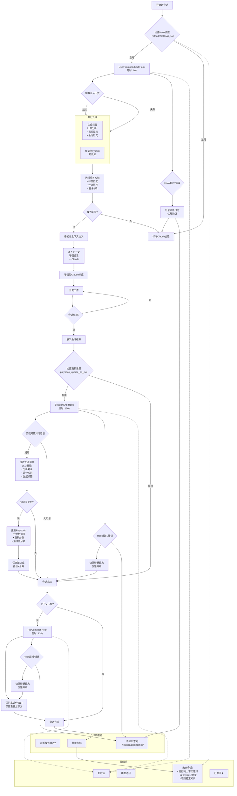

# Agentic Context Engineering

中文 | [English](README.md)

Agentic Context Engineering (ACE) - 智能知识积累与上下文注入系统，专为 Claude Code 打造。

通过自动化学习对话轨迹，持续提取、评估和整合关键知识点，实现知识的自我进化与智能注入。

## ✨ 核心价值

- **零感知学习**：自动从对话中提取有价值的知识点，无需手动维护
- **智能评估**：基于实际效果动态评分，保留有效知识，淘汰无效内容
- **精准注入**：根据对话主题智能匹配相关知识，提升 Claude Code 的响应质量
- **持续进化**：通过语义相似性合并（≥80%）避免重复，通过分数机制持续优化

## 🚀 快速开始

### 安装

```bash
git clone https://github.com/greatyingzi/agentic_context_engineering.git
cd agentic_context_engineering
npm install
```

### 配置环境

```bash
# 安装依赖（推荐使用 uv）
uv venv ~/.claude/.venv
uv pip install --python ~/.claude/.venv/bin/python3 anthropic

# 配置 API（可选，支持 fallback）
export AGENTIC_CONTEXT_API_KEY="your-api-key"
export AGENTIC_CONTEXT_MODEL="claude-3-5-sonnet-20241022"
```

### 激活系统

重启 Claude Code，系统将自动在所有项目中生效。

## 🏗️ 系统架构

### 核心 Hook 机制

系统通过三个关键 Hook 实现全自动化：

1. **UserPromptSubmit** - 在新会话开始时智能注入相关知识
2. **SessionEnd** - 会话结束时提取和评估知识点
3. **PreCompact** - 上下文压缩前保护重要知识

### 知识生命周期

```
提取 → 评估 → 评分 → 合并 → 标记 → 清理 → 注入
```

- **评分机制**：有用 +1，有害 -3，中性 0 分
- **智能合并**：语义相似度 ≥80% 自动合并，分数累加
- **自动清理**：分数 ≤ -5 的知识点自动移除
- **精准标记**：每个知识点都有主题标签，实现精准匹配

### 数据流架构

```
对话轨迹 → 特征提取 → LLM 分析 → 知识存储 → 智能注入 → 提升响应
```

## 📋 高级功能

### 典型开发工作流

系统通过智能的Hook机制实现自动化知识管理：



### `/init-playbook` - 历史知识批量提取

从历史对话中批量提取知识点，快速构建知识库：

```bash
/init-playbook
```

- 自动识别项目历史记录
- 默认处理最近 200 条对话
- 支持自定义参数（通过环境变量配置）

### 诊断模式

启用详细日志记录：

```bash
touch .claude/diagnostic_mode  # 启用
rm .claude/diagnostic_mode      # 禁用
```

### 行为配置

在 `~/.claude/settings.json` 中自定义：

```json
{
  "playbook_update_on_exit": true,   # /exit 时更新知识库
  "playbook_update_on_clear": true   # /clear 时更新知识库
}
```

## 📁 目录结构

```
.
├── install.js                 # 全局安装脚本
├── package.json               # npm 配置
├── src/
│   ├── hooks/                 # 核心 Hook 实现
│   │   ├── common.py          # 共享工具
│   │   ├── session_end.py     # 会话结束处理
│   │   ├── precompact.py      # 上下文压缩处理
│   │   └── user_prompt_inject.py  # 知识注入
│   ├── prompts/               # LLM 提示模板
│   │   ├── reflection.txt     # 知识提取模板
│   │   └── playbook.txt       # 知识注入模板
│   ├── commands/              # 自定义命令
│   │   └── init-playbook.md   # /init-playbook 命令
│   ├── scripts/               # 辅助脚本
│   │   └── bootstrap_playbook.py  # 知识库初始化
│   └── settings.json          # 配置模板
└── README.md
```

## 🔧 技术栈

- **Python** - 核心逻辑与 Hook 实现
- **Node.js** - 安装与部署自动化
- **Anthropic Claude API** - 智能分析引擎
- **JSON** - 轻量级知识存储

## 🎯 设计哲学

ACE 遵循"优雅自动化"原则：

- **无侵入性**：完全利用 Claude Code 原生 Hook 机制
- **智能适应**：根据实际效果持续优化知识质量
- **轻量高效**：JSON 存储，最小化性能开销
- **渐进增强**：从零开始，逐步构建知识体系

## 📈 效果体现

使用 ACE 后，Claude Code 将：

- 更快理解项目特定需求和上下文
- 避免重复性错误和建议
- 提供更精准的代码和架构建议
- 记住项目特有的开发模式和偏好

## 📄 许可证

MIT License