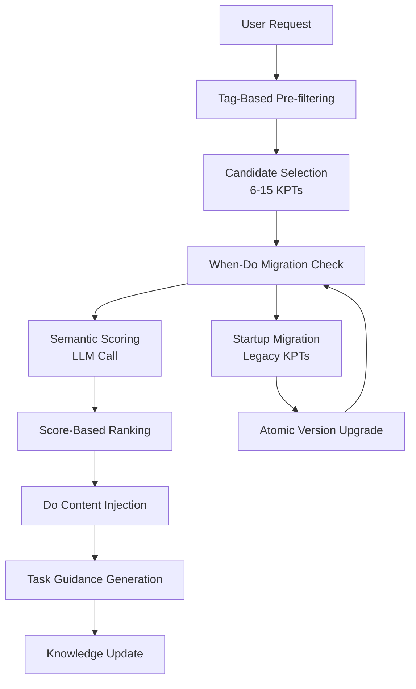

# When-Do Semantic Matching Architecture

## Executive Summary

This document defines the architectural transition from tag-based knowledge point (KPT) matching to a sophisticated when-do semantic matching system. The transformation maintains system stability while significantly enhancing contextual understanding and knowledge relevance.

## Table of Contents

1. [Background & Motivation](#background--motivation)
2. [Design Principles](#design-principles)
3. [Architecture Overview](#architecture-overview)
4. [Data Structure Evolution](#data-structure-evolution)
5. [Core Algorithms](#core-algorithms)
6. [Implementation Strategy](#implementation-strategy)
7. [Migration Plan](#migration-plan)
8. [Performance Considerations](#performance-considerations)
9. [Risk Assessment](#risk-assessment)

## Background & Motivation

### Current System Limitations

The existing tag-based matching system faces several fundamental challenges:

1. **Static Classification**: Tags require manual maintenance and consistency enforcement
2. **Semantic Blindness**: Tag matching cannot understand "API failure" vs "interface error" similarity
3. **Maintenance Overhead**: New tags proliferate without semantic understanding
4. **Context Rigidity**: Tags lack situational awareness and adaptability

### The When-Do Revolution

The when-do paradigm separates triggering conditions from execution actions:

- **When**: Lightweight condition description (20-50 characters) for semantic matching
- **Do**: Detailed action guidance for practical implementation

This separation enables:
- **Semantic Understanding**: LLM can comprehend intent similarity
- **Cost Efficiency**: Matching based on short when conditions
- **Precision Focus**: Selected actions are detailed and actionable

## Design Principles

### 1. Gradual Evolution
- Maintain existing tag matching as fallback
- Layer semantic enhancement on top of proven systems
- Allow rollback to previous state if needed

### 2. Cost Control
- Semantic matching limited to candidate set only
- When conditions optimized for brevity (20-50 chars)
- Caching and memoization for repeated patterns

### 3. User Experience Priority
- Migration happens seamlessly at startup
- No manual intervention required
- Backward compatibility guaranteed

### 4. Fault Tolerance
- Every failure mode has defined fallback
- Data integrity preserved during migration
- Diagnostic logging for troubleshooting

## Architecture Overview



### Information Flow Analysis

1. **Pre-filtering**: Existing tag matching selects candidate subset (6-15 KPTs)
2. **Semantic Scoring**: LLM evaluates relevance based on when conditions only
3. **Action Injection**: Only highest-scoring DO content injected for guidance
4. **Continuous Learning**: New knowledge points follow when-do format

## Data Structure Evolution

### Legacy Format (v1.0)
```json
{
  "id": "KPT-001",
  "text": "When API calls fail, check network status and implement retry mechanism",
  "tags": ["api", "network", "error"],
  "score": 2,
  "metadata": {...}
}
```

### Enhanced Format (v2.0)
```json
{
  "id": "KPT-001",
  "when": "API calls failing repeatedly",
  "do": "Check network connectivity, verify service status, implement exponential backoff retry with circuit breaker pattern",
  "tags": ["api", "network", "error"],
  "score": 2,
  "version": "2.0",
  "metadata": {...}
}
```

### Migration Metadata
```json
{
  "migration_info": {
    "migrated_at": "2024-01-15T10:30:00Z",
    "source_version": "1.0",
    "migration_success": true,
    "llm_confidence": 0.92,
    "fallback_available": true
  }
}
```

## Core Algorithms

### 1. Version Detection Algorithm

```python
def detect_kpt_version(kpt):
    """Detect KPT format version with robust fallback"""
    if "when" in kpt and "do" in kpt and kpt.get("version") == "2.0":
        return "2.0"
    elif "text" in kpt and not ("when" in kpt and "do" in kpt):
        return "1.0"
    else:
        return "mixed"  # Partial migration detected
```

### 2. Intelligent Migration Algorithm

```python
def migrate_legacy_kpt_to_when_do(legacy_kpt):
    """Convert legacy text-based KPT to when-do format"""

    migration_prompt = f"""
Convert this knowledge point to when-do format:
Original: {legacy_kpt['text']}

Requirements:
- When: 20-50 characters describing trigger condition
- Do: Detailed action steps (50-200 characters)
- Preserve semantic accuracy and technical precision

Return JSON:
{{
  "when": "...",
  "do": "...",
  "confidence": 0.0-1.0,
  "reasoning": "Brief explanation of separation logic"
}}
"""

    result = llm_call(migration_prompt)
    return validate_and_merge_kpt(legacy_kpt, result)
```

### 3. Dual-Layer Selection Algorithm

```python
def select_candidates_semantically(playbook, user_request, temperature=0.5):
    """Dual-layer selection: tag filtering + semantic scoring"""

    # Layer 1: Tag-based pre-filtering
    candidates = select_relevant_keypoints(
        playbook,
        tags=extract_tags_from_request(user_request),
        limit=adjust_candidate_limit(temperature)  # 6-15 based on temp
    )

    # Layer 2: When-based semantic scoring
    candidate_when_conditions = [
        kp.get('when', extract_when_from_text(kp.get('text', '')))
        for kp in candidates
    ]

    scoring_result = semantic_scoring_llm_call(
        user_request=user_request,
        when_conditions=candidate_when_conditions,
        temperature=temperature
    )

    # Rank by semantic score
    ranked_candidates = rank_by_semantic_score(candidates, scoring_result)

    return ranked_candidates[:6]  # Top 6 for final injection
```

### 4. Semantic Scoring Prompt Template

```
Rate semantic relevance for each WHEN condition relative to the user's request.

User Request: {user_request}

Candidate WHEN Conditions:
1. {when_condition_1}
2. {when_condition_2}
...

Scoring Criteria:
- Semantic similarity: How closely does the WHEN match user intent? (0-1)
- Context applicability: Is this condition appropriate for current context? (0-1)
- Action relevance: Would the associated DO action help solve the request? (0-1)

Return JSON:
{{
  "scores": [
    {{"index": 1, "semantic_similarity": 0.8, "context_applicability": 0.9, "action_relevance": 0.85, "overall": 0.85}},
    ...
  ]
}}
```

## Implementation Strategy

### Phase 1: Foundation Setup (Week 1)

#### 1.1 New Module Structure
```
src/hooks/
├── kpt_versioning.py      # Version detection and management
├── kpt_migrator.py       # Legacy to when-do migration
├── semantic_scorer.py     # Semantic matching algorithms
└── when_selector.py       # Dual-layer selection logic
```

#### 1.2 Prompt Template Enhancement
```
src/prompts/
├── semantic_scoring.txt    # When-condition scoring template
├── kpt_migration.txt      # Legacy to when-do migration
└── task_guidance_v2.txt   # Enhanced guidance template
```

### Phase 2: Migration Implementation (Week 2)

#### 2.1 Startup Migration Integration
```python
def load_playbook_with_migration():
    """Load playbook with automatic migration detection"""

    playbook = load_existing_playbook()
    migration_status = detect_migration_needs(playbook)

    if migration_status.requires_migration:
        logger.info(f"Migrating {migration_status.count} legacy KPTs to when-do format")

        with migration_context() as ctx:
            migrated_playbook = execute_migration(playbook)
            save_playbook_atomic(migrated_playbook, ctx)

        log_migration_success(migration_status.count)
        return migrated_playbook

    return playbook
```

#### 2.2 Atomic Migration with Rollback
```python
@contextmanager
def migration_context():
    """Ensure atomic migration with automatic rollback"""
    backup_path = create_playbook_backup()
    try:
        yield
        # Success: cleanup backup after validation
        if validate_migrated_playbook():
            remove_backup(backup_path)
        else:
            restore_from_backup(backup_path)
            raise MigrationError("Migration validation failed")
    except Exception as e:
        restore_from_backup(backup_path)
        raise MigrationError(f"Migration failed: {e}")
```

### Phase 3: Semantic Integration (Week 3)

#### 3.1 Enhanced User Prompt Injection
```python
def main():
    """Enhanced main function with semantic scoring"""

    # Existing setup unchanged
    playbook = load_playbook_with_migration()
    prompt = get_user_prompt()
    temperature = extract_temperature_from_conversation()

    # New: semantic-enhanced selection
    selected_kpts = select_candidates_semantically(
        playbook=playbook,
        user_request=prompt,
        temperature=temperature
    )

    # Extract DO content only for selected KPTs
    do_content = [kp.get('do', kp.get('text', '')) for kp in selected_kpts]

    # Continue with existing flow
    guidance = generate_context_aware_guidance(
        prompt=prompt,
        selected_key_points=selected_kpts,
        do_content=do_content,
        temperature=temperature
    )

    save_user_prompt_injection(guidance, temperature)
```

### Phase 4: Validation & Optimization (Week 4)

#### 4.1 A/B Testing Framework
- Run tag-based and semantic-based selection in parallel
- Compare user satisfaction scores
- Monitor cost-effectiveness metrics

#### 4.2 Performance Optimization
- Implement caching for semantic scoring results
- Optimize prompt lengths and token usage
- Batch processing for multiple KPTs

## Migration Plan

### Developer Environment (Pre-deployment)

1. **Codebase Migration**
   ```bash
   # Migrate built-in KPTs to when-do format
   python scripts/migrate_built_in_kpts.py
   git commit -m "feat: migrate to when-do format v2.0"
   ```

2. **Version Bump**
   - Update package.json to reflect new format
   - Include migration notes in changelog

### User Environment (First Startup)

1. **Automatic Detection**
   - System detects legacy format in user's playbook.json
   - Initiates migration sequence with user notification

2. **Seamless Migration**
   - Backup original file
   - Migrate each KPT with LLM assistance
   - Validate migration quality
   - Commit changes atomically

3. **Fallback Support**
   - If migration fails, restore from backup
   - Log detailed error information
   - Provide manual migration instructions

### Validation Checklist

- [ ] All 59 built-in KPTs successfully migrated
- [ ] Migration preserves semantic meaning
- [ ] When conditions are 20-50 characters
- [ ] DO actions are detailed and actionable
- [ ] Backward compatibility maintained
- [ ] Migration completes within 30 seconds
- [ ] No data loss during migration

## Performance Considerations

### Token Usage Analysis

**Legacy System**:
```
Tag matching: 0 tokens (local processing)
Full KPT injection: ~3000 tokens (6 KPTs × 500 chars)
```

**Enhanced System**:
```
Tag pre-filtering: 0 tokens (local processing)
When injection for scoring: ~800 tokens (10 candidates × 80 chars)
DO injection for guidance: ~1800 tokens (6 KPTs × 300 chars)
Total: ~2600 tokens (13% reduction)
```

### Latency Impact

| Operation | Legacy | Enhanced | Impact |
|-----------|---------|----------|---------|
| KPT Selection | ~50ms | ~200ms | +150ms (semantic scoring) |
| Migration | N/A | ~15s | One-time cost |
| Overall Response | ~300ms | ~450ms | +150ms |

### Scalability Analysis

**As playbook grows to 1000 KPTs**:

- Tag pre-filtering maintains constant time
- Semantic scoring limited to candidate subset
- Overall complexity: O(log n) instead of O(n)

## Risk Assessment

### High Severity Risks

1. **Migration Data Loss**
   - **Risk**: 59 built-in KPTs corrupted during migration
   - **Mitigation**: Atomic migration with automatic rollback
   - **Recovery**: Git-based recovery of built-in data

2. **Semantic Quality Degradation**
   - **Risk**: When-do separation loses context
   - **Mitigation**: Confidence scoring and manual validation
   - **Recovery**: Fallback to original text format

### Medium Severity Risks

3. **Cost Increase**
   - **Risk**: Additional LLM calls increase operational costs
   - **Mitigation**: Candidate limiting and prompt optimization
   - **Monitoring**: Real-time cost tracking and alerts

4. **Performance Regression**
   - **Risk**: Semantic scoring adds latency
   - **Mitigation**: Caching and parallel processing
   - **Monitoring**: Response time thresholds

### Low Severity Risks

5. **User Experience Disruption**
   - **Risk**: Migration causes startup delay
   - **Mitigation**: Progress indication and background processing
   - **Recovery**: Skip migration with warning option

---

## Conclusion

The when-do semantic matching architecture represents a fundamental advancement in knowledge point relevance and contextual understanding. By maintaining backward compatibility while introducing semantic intelligence, this evolution preserves system stability while significantly enhancing user experience.

The dual-layer selection strategy ensures cost efficiency while maximizing the potential of LLM semantic understanding capabilities. The migration plan guarantees smooth transition for both developers and end users.

Implementation should proceed following the phased approach outlined above, with continuous monitoring and optimization based on real-world usage patterns.

---

**Document Version**: 1.0
**Last Updated**: 2024-01-15
**Next Review**: 2024-02-15